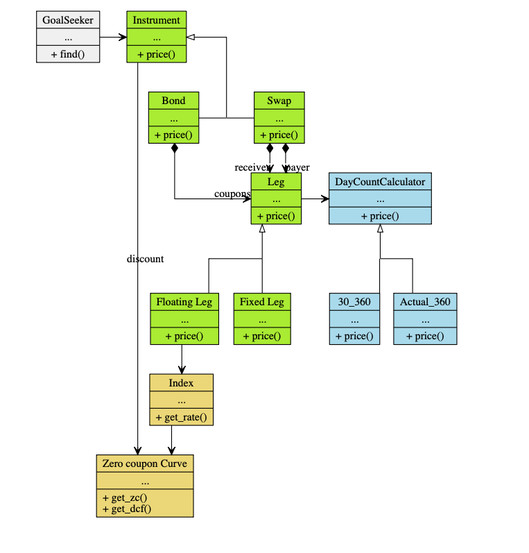
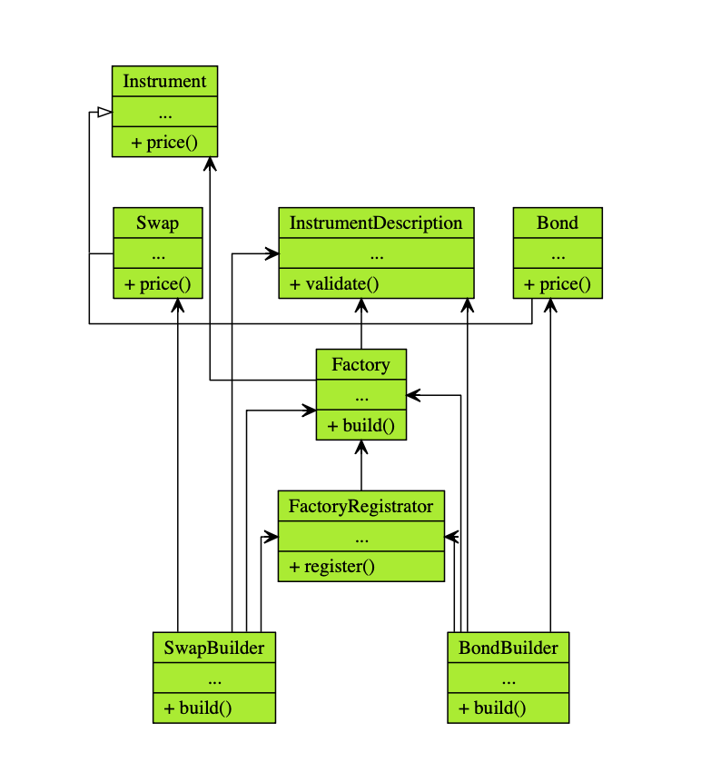
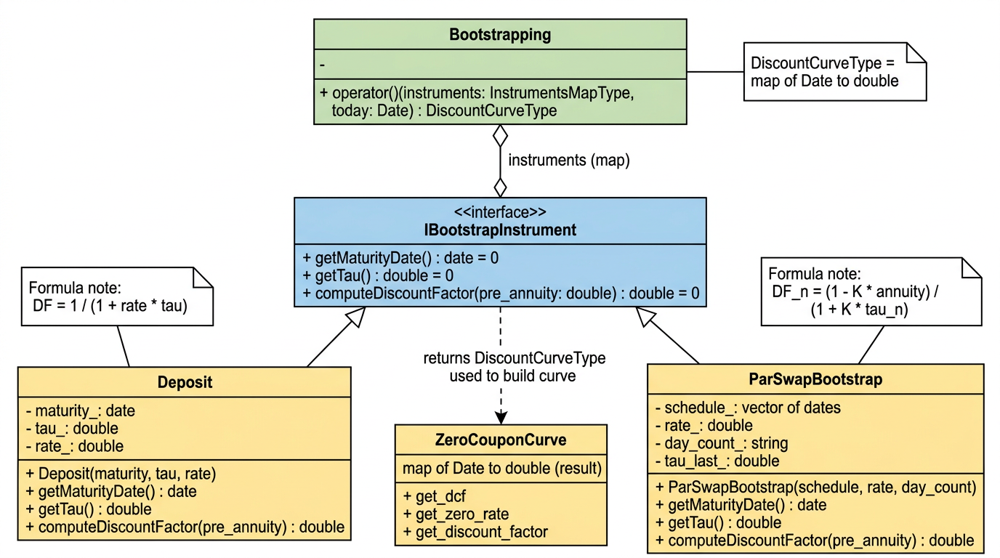

# Bonds, Swaps and Curve Calibration Engine


A fixed-income valuation engine in **C++14** that prices **bonds and interest-rate swaps** off a continuously-compounded **zero-coupon yield curve**, and calibrates that curve **node by node** from a strip of market-quoted deposits and par swaps.

The codebase is organised around two layers (`Core` and `Rates`), uses a **Factory + builder-registrator** design pattern for instrument construction, and is validated by **62 Boost.Test cases** that anchor every public function to a worked numeric example — every cell of every table below has its corresponding test in the suite.

---

## Overview

The engine covers three functional blocks:

1. **Bond and IRS valuation** — present value via cash-flow discounting on a continuously-compounded zero-coupon curve.
2. **Factory pattern with builder registration** — instruments are built from a high-level `InstrumentDescription` without the caller knowing the concrete constructor.
3. **Iterative discount-curve bootstrapping** — discount factors are calibrated node by node from market-quoted deposits and par swaps.

---

## Class diagrams and design decisions







The diagrams cover: `Instrument`, `Leg`, `FixedLeg`, `FloatingLeg`, `Bond`, `Swap`, `ZeroCouponCurve`, `InstrumentDescription`, `Factory`, `FactoryRegistrator`, `SwapBuilder`, `BondBuilder`, `Bootstrapping`, `IBootstrapInstrument`, `Deposit`, `ParSwapBootstrap` (with `DayCountCalculator`, `Actual_360`, `Thirty_360` for day-count conventions).

**Design decisions:** Factory + registrator pattern; explicit day-count conventions through a `DayCountCalculator` interface; node-based curve without interpolation; iterative bootstrap with annuity (`IBootstrapInstrument`); explicit schedules on `LegDescription`.

---

## Scope

| Module | Main classes / files |
|--------|----------------------|
| **Core** | `Instrument`, `ZeroCouponCurve`, `DayCountCalculator` (`Actual_360`, `Thirty_360`), `InstrumentDescription` (with `LegDescription` and explicit schedule), `Factory`, `FactoryRegistrator` |
| **Core – Bootstrap** | `IBootstrapInstrument`, `Bootstrapping`, `Deposit`, `ParSwapBootstrap` |
| **Rates** | `Leg`, `FixedLeg`, `FloatingLeg`, `Bond`, `Swap`, `SwapBuilder`, `BondBuilder`, `ScheduleUtils` |

The curve is defined by discrete nodes (date, continuous rate) without interpolation. Cash flows are discounted as `DF(0,T) = exp(−Rc·T)`. Each leg carries an **explicit schedule** (vector of payment dates) in `LegDescription::schedule`; those dates must coincide with the nodes of the `ZeroCouponCurve` for discounting to work. The caller building the description can generate the schedule with `Rates::make_schedule(start, end, months)` or set the dates by hand in a `std::vector<boost::gregorian::date>`.

---

## Tech stack

- **Language:** C++14 (Apple Clang / GCC).
- **Build system:** CMake with custom macros (`create_library`, `boost_test_project`); out-of-tree build (`build/`).
- **Test framework:** Boost.Test — two independent executables: `test_core` (38 cases) and `test_rates` (24 cases).
- **Date library:** Boost.Date_Time (`boost::gregorian::date`).

A spreadsheet replicating the same valuations cell-by-cell ([`worked-examples.xlsx`](worked-examples.xlsx)) ships alongside the code as a parallel evidence artefact: every Boost.Test case below is anchored to a row in that workbook, so the C++ and the Excel agree on every number to the last decimal.

---

## How to run the tests

```bash
cd build
cmake ..
make -j4
./test_core    # 38 tests
./test_rates   # 24 tests
# or: ctest --output-on-failure
```

Test source paths:

| Executable | Path | Test files |
|------------|------|-----------|
| **test_core** | `build/test_core` | `src/Core/tests/test_bootstrapping.cpp` (Table 6, bootstrap) |
| | | `src/Core/tests/test_instrumentdescription.cpp` (LegDescription validation) |
| | | `src/Core/tests/test_zerocouponcurve.cpp` (zero-coupon curve) |
| | | `src/Core/tests/test_daycount.cpp` (Actual_360, Thirty_360) |
| **test_rates** | `build/test_rates` | `src/Rates/tests/test_swap_curve.cpp` (Tables 1–4, swap) |
| | | `src/Rates/tests/test_bond_curve.cpp` (Table 5, bond) |
| | | `src/Rates/tests/test_factory_builders_schedule.cpp` (Factory, builders, ScheduleUtils) |

Each file defines one or more suites (`BOOST_AUTO_TEST_SUITE`); the suite names match those in the summary table at the bottom of this document.

```
Running 38 test cases...
*** No errors detected

Running 24 test cases...
*** No errors detected
```

---

## Worked example A — IRS valuation (Tables 1–4)

**Context:** notional 100,000,000 € IRS, Actual/360, valuation date 01/04/2016.

### Table 1 — Time structure and zero-coupon discount curve

The time grid and the discount factors derived from the continuously-compounded rates ($R_c$).

| Period | Start | End | Days | $\tau$ (Act/360) | Cumulative $T_i$ | ZC ($R_c$) | DF ($P(0,T_i)$) |
| :---: | :---: | :---: | :---: | :---: | :---: | :---: | :---: |
| 1 | 01/04/2016 | 03/10/2016 | 185 | 0.513889 | 0.513889 | 0.0474 | 0.97593 |
| 2 | 03/10/2016 | 03/04/2017 | 182 | 0.505556 | 1.019444 | 0.0500 | 0.95030 |
| 3 | 03/04/2017 | 02/10/2017 | 182 | 0.505556 | 1.525000 | 0.0510 | 0.92517 |
| 4 | 02/10/2017 | 02/04/2018 | 182 | 0.505556 | 2.030556 | 0.0520 | 0.89977 |

Tests against Table 1 (suite `Swap_README_Excel_tests`):

- `year_fractions_dcf_match_readme_table1` — `get_dcf()` matches the cumulative $T$ values (tol. 1e-5).
- `discount_factors_match_readme_table1` — `get_discount_factor()` matches the DF values (tol. 1e-4).

### Table 2 — Floating leg, Euribor 6M

Projected variable cash flows.

| Period | Start | End | Continuous fwd ($RF_{cc}$) | Euribor 6M ($R_m$) | Floating coupon (CF) | Floating-leg PV |
| :---: | :---: | :---: | :---: | :---: | :---: | :---: |
| 1 | 01/04/2016 | 03/10/2016 | 0.047400 | 0.048000 *(fix)* | 2,465,742.10 | 2,406,406.33 |
| 2 | 03/10/2016 | 03/04/2017 | 0.052646 | 0.053345 | 2,697,120.12 | 2,563,086.92 |
| 3 | 03/04/2017 | 02/10/2017 | 0.053014 | 0.053723 | 2,716,520.30 | 2,513,250.06 |
| 4 | 02/10/2017 | 02/04/2018 | 0.055014 | 0.055778 | 2,820,430.64 | 2,537,807.94 |
| **TOTAL** | | | | | **10,699,387.00** | **10,020,551.24** |

Tests against Table 2:

- `floating_rates_euribor6m_match_readme_table2` — forward rates (tol. 1e-3).
- `floating_coupon_amounts_match_readme_table2` — coupon amounts in € (tol. 1.0 €).
- `floating_leg_pv_total_match_readme_table2` — total PV = **10,020,551.24 €** (tol. 1.0 €).

### Table 3 — Par swap (K = 0.052613)

The par swap rate ($K$) is computed as $PV_{Float} / (N \cdot \sum(\tau_i \cdot DF_i))$.

| Period | Start | End | Annuity ($\tau_i \cdot DF_i$) | Par swap rate ($K$) | Par fixed coupon | Fixed-leg PV |
| :---: | :---: | :---: | :---: | :---: | :---: | :---: |
| 1 | 01/04/2016 | 03/10/2016 | 0.501523 | 0.052613 | 2,703,723.86 | 2,638,661.28 |
| 2 | 03/10/2016 | 03/04/2017 | 0.480432 | 0.052613 | 2,659,879.69 | 2,527,697.15 |
| 3 | 03/04/2017 | 02/10/2017 | 0.467726 | 0.052613 | 2,659,879.69 | 2,460,847.72 |
| 4 | 02/10/2017 | 02/04/2018 | 0.454896 | 0.052613 | 2,659,879.69 | 2,393,345.09 |
| **TOTAL** | | | **1.904577** | | | **10,020,551.24** |

Test: `swap_at_par_near_zero_readme_table3` — at the par K, the NPV is ≈ 0 (|NPV| < 1 €).

### Table 4 — Off-market swap at 5 %

Entity A's position: receive floating, pay fixed (5 %).
$NPV_{Swap} = PV_{Floating} - PV_{Fixed}$.

| Period | Start | End | Example fixed rate | Fixed coupon (5 %) | Fixed-leg PV (5 %) | Swap MtM (value) |
| :---: | :---: | :---: | :---: | :---: | :---: | :---: |
| 1 | 01/04/2016 | 03/10/2016 | 0.0500 | 2,569,444.44 | 2,507,613.17 | - |
| 2 | 03/10/2016 | 03/04/2017 | 0.0500 | 2,527,777.78 | 2,402,160.03 | - |
| 3 | 03/04/2017 | 02/10/2017 | 0.0500 | 2,527,777.78 | 2,338,630.66 | - |
| 4 | 02/10/2017 | 02/04/2018 | 0.0500 | 2,527,777.78 | 2,274,480.51 | - |
| **TOTAL** | | | | | **9,522,884.37** | **+497,666.88** |

Test: `swap_mtm_receive_float_pay_fixed_5_match_readme_table4` — NPV = **+497,666.88 €** (tol. 1.0 €).

---

## Worked example B — Bond valuation (Table 5)

**Context:** 2-year bond, face 100, 6 % annual coupon paid semi-annually, 30/360, valuation date 01/04/2014.

### Table 5 — Bond cash-flow discounting

| Period | dcf (30/360) | Rc | DF | Cash flow | PV of cash flow |
|:---:|:---:|:---:|:---:|:---:|:---:|
| 1 | 0.5 | 0.050 | 0.9753099 | 3.0 | 2.9259297 |
| 2 | 1.0 | 0.058 | 0.9436499 | 3.0 | 2.8309498 |
| 3 | 1.5 | 0.064 | 0.9084640 | 3.0 | 2.7253920 |
| 4 | 2.0 | 0.068 | 0.8728426 | 103.0 | 89.9027912 |
| **Total** | | | | | **98.3850628** |

Tests against Table 5 (suite `Bond_curve_PDF_tests`):

- `bond_pv_matches_pdf_example` — `FixedLeg::price()` = **98.3850627729396** (tol. 1e-15).
- `bond_instrument_pv_matches_pdf` — `Bond::price()` = **98.3850627729396** (tol. 1e-15).
- `zero_curve_dcf_and_zc_continuous` — `get_dcf()` and `get_discount_factor()` exact (tol. 1e-15).
- `factory_builds_bond_and_pv_matches_pdf` — Factory → Bond, price = **98.3850627729396** (tol. 1e-10).

---

## Worked example C — Discount-curve bootstrapping (Table 6)

**Context:** iterative calibration from a 6-month deposit and three IRS.
**Day-count convention:** Actual/360 across all instruments.
**Valuation date:** 01/04/2016.

| Period | Instrument | Market rate | Start | End | Days | $\tau$ (Act/360) | Cumulative $T_i$ | DF ($P(0,T_i)$) | Simple ZC | Continuous ZC ($R_c$) |
| :---: | :---: | :---: | :---: | :---: | :---: | :---: | :---: | :---: | :---: | :---: |
| 0 | Today | - | - | 01/04/2016 | - | - | 0.0000000 | 1.0000000 | - | - |
| 1 | Depo 6m | 0.050 | 01/04/2016 | 03/10/2016 | 185 | 0.5138889 | 0.5138889 | 0.9749492 | 0.0500000 | 0.0493684 |
| 2 | Swap 12m | 0.055 | 03/10/2016 | 03/04/2017 | 182 | 0.5055556 | 1.0194444 | 0.9461363 | 0.0558443 | 0.0543126 |
| 3 | Swap 18m | 0.060 | 03/04/2017 | 02/10/2017 | 182 | 0.5055556 | 1.5250000 | 0.9135292 | 0.0620693 | 0.0593049 |
| 4 | Swap 2y | 0.064 | 02/10/2017 | 02/04/2018 | 182 | 0.5055556 | 2.0305556 | 0.8793138 | 0.0675925 | 0.0633390 |

Deposit formula: DF = 1 / (1 + r·τ).
Par-swap formula: DF_n = (1 − K·previous_annuity) / (1 + K·τ_n).

Tests against Table 6 (suite `Bootstrapping_README_Table6_tests`):

- `bootstrap_curve_discount_factors_match_table6` — DFs at the 4 nodes match the table (tol. 1e-6).
- `bootstrap_implied_zero_rates_continuous_match_table6` — Rc = −ln(DF)/T at the 4 nodes (tol. 1e-6).
- `deposit_6m_discount_factor_match_table6` — Deposit alone: DF = **0.9749492** (tol. 1e-6).
- `par_swap_12m_discount_factor_match_table6` — `ParSwapBootstrap` with the right annuity: DF = **0.9461363** (tol. 1e-6).

---

## Suite summary

| Executable | Suite | Tests | Result |
|-----------|-------|-------|--------|
| test_rates | `Swap_README_Excel_tests` | 8 | passing |
| test_rates | `Bond_curve_PDF_tests` | 4 | passing |
| test_rates | `ScheduleUtils_tests` | 3 | passing |
| test_rates | `SwapBuilder_tests` | 2 | passing |
| test_rates | `BondBuilder_tests` | 2 | passing |
| test_rates | `Factory_tests` + `FactoryRegistrator_tests` | 5 | passing |
| test_core | `Bootstrapping_README_Table6_tests` | 4 | passing |
| test_core | `InstrumentDescription_validate_tests`, `DayCount_tests`, `ZeroCouponCurve_tests`, … | 34 | passing |

---

## Roadmap and possible improvements

| Item | Description |
|------|-------------|
| **Curve interpolation** | Today `ZeroCouponCurve` only returns rates / DFs at existing nodes; there is no interpolation between them. A natural extension is linear interpolation (or log-linear on DF) for intermediate dates, so cash flows on dates that don't align exactly with the nodes can be discounted. |
| **More instruments in bootstrap** | Adding other `IBootstrapInstrument` types (e.g. FRAs, futures) would let intermediate nodes or curves in other currencies be calibrated. |
| **Solver for the par rate** | A utility that solves for the fixed rate that makes the swap par (given the schedule and the curve), instead of trying values by hand or in Excel. |
| **Holiday calendar** | Schedules are generated on exact dates (or via `make_schedule`); business-day conventions (Modified Following, etc.) are not applied to roll dates onto trading days. |

---

## Reference

The engine implements the canonical zero-coupon bond pricing formula and the standard par-swap bootstrap recipe. The numerics in the tables above are the textbook examples used to validate any production-grade fixed-income pricer end to end.
