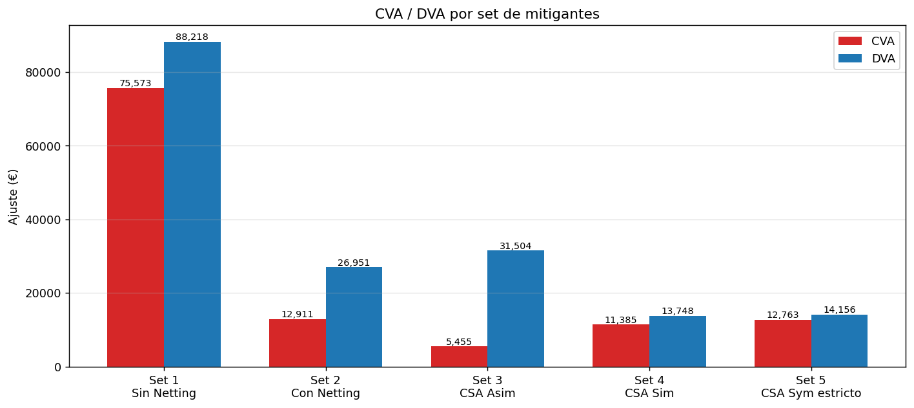
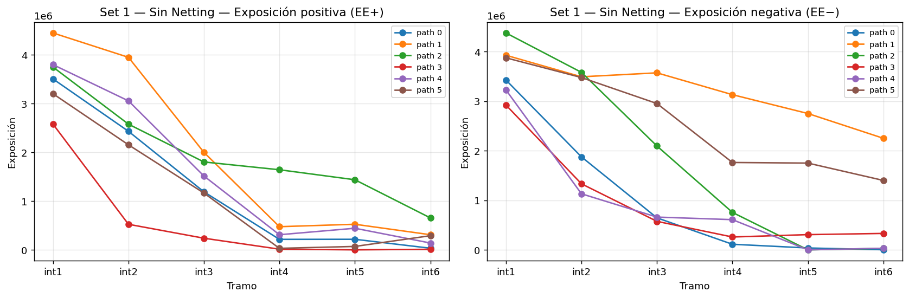
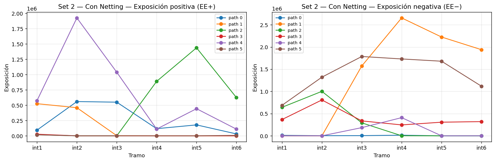
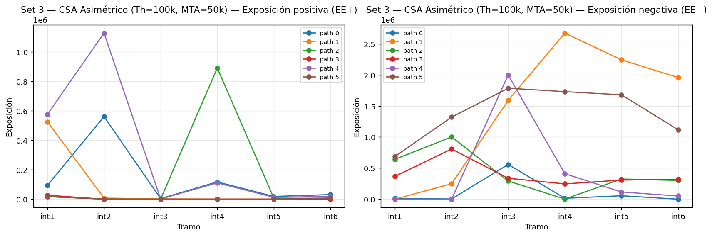
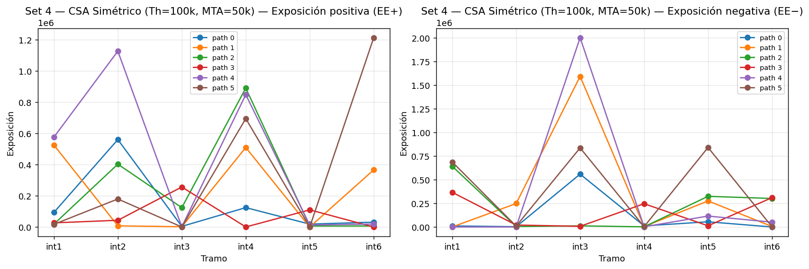
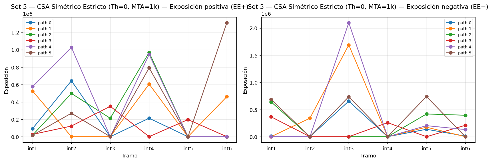
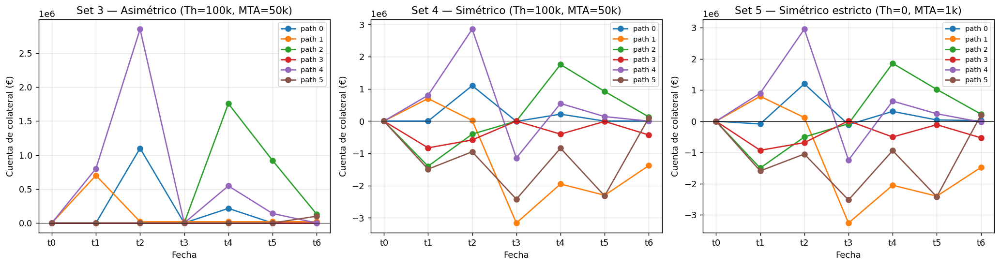

# xVA — Credit and Funding Valuation Adjustments


A Monte Carlo case study that prices the **CVA**, **DVA** and **FVA** of a four-deal derivatives book under five different mitigant regimes — from no agreement at all to a strict bilateral CSA — and quantifies the impact each mitigant has on the bilateral counterparty risk a desk has to charge or pay.

The work is built on a single Excel workbook. For each set of mitigants the workbook nets the four-deal NPVs path by path, rolls the collateral account under the agreed Threshold / MTA rules, derives the positive and negative exposure curves with the **opposite-sign weighting** the methodology requires for tramos that cross zero, and applies the standard CVA / DVA / FVA discounting recipe. The bonus track adds the funding adjustment on top of the collateral account, splitting it into Funding Benefit and Funding Cost.

---

## Project layout

```
xva-credit-and-funding-adjustments/
├── xva-workbook.xlsx           # Workbook with 9 sheets (inputs, 5 sets, FVA, summary)
├── figures/
│   ├── set1_sin_netting.png    # EE+ / EE- per path, no mitigants
│   ├── set2_con_netting.png    # … with netting
│   ├── set3_csa_asym.png       # … asymmetric CSA (only B posts)
│   ├── set4_csa_sym.png        # … symmetric CSA
│   ├── set5_csa_strict.png     # … symmetric CSA strict (Th=0, MTA=1k)
│   ├── collateral_paths.png    # Collateral account paths for Sets 3 / 4 / 5
│   └── summary_cva_dva.png     # CVA / DVA across all five sets
└── README.md
```

The workbook is the main artifact. It carries the inputs (`Datos de Mercado`, `Deals`), one sheet per set with NPV, collateral, EE+, EE-, and the per-path CVA/DVA matrix, plus an `FVA` sheet and a `Resultados Finales` summary.

---

## The five mitigant sets

| # | Set | Threshold | MTA | Posts |
| :--- | :--- | ---: | ---: | :--- |
| 1 | No mitigants | — | — | — |
| 2 | Netting only | — | — | — |
| 3 | CSA asymmetric | 100,000 | 50,000 | only B posts |
| 4 | CSA symmetric | 100,000 | 50,000 | both post |
| 5 | CSA symmetric strict | 0 | 1,000 | both post |

A **break clause** is exercised on two of the four deals: Deal 3 terminates at `t4` and Deal 4 at `t3` (NPV pinned to 0 at the break date). Past that date the deal contributes zero exposure on every path.

---

## Methodology

### Interval exposure with sign weighting

For an interval `[t, t+1]`, when the netted NPVs at the two endpoints share a sign:

```
EE+ = (NPV+(t) + NPV+(t+1)) / 2
EE- = (|NPV-(t)| + |NPV-(t+1)|) / 2
```

When the signs flip across the interval, the exposure of each side does **not** apply over the whole interval — it has to be **weighted by the time the path actually spends on that side** (linear interpolation, equivalent to time-fraction × average):

```
Σ |NPV| = |NPV(t)| + |NPV(t+1)|
ω+      = NPV+ / Σ |NPV|         ← positive-side weight
ω-      = |NPV-| / Σ |NPV|       ← negative-side weight

EE+ = ((NPV+(t) + NPV+(t+1)) / 2) × ω+
EE- = ((|NPV-(t)| + |NPV-(t+1)|) / 2) × ω-
```

The weighting reduces both EE+ and EE- exactly when the path crosses zero — the simplification of taking a flat average overcounts exposure on the side that is "leaving the money."

### Collateral account roll

For each interval `[t, t+1]` the relevant collateral is the value **at the start of the interval**, `Coll(t)`. At `t+1` the account is rebalanced taking three things into account: the previous `Coll(t)`, the new `NPV(t+1)`, and the CSA rules (Threshold and MTA):

```
target(t+1) =
    NPV(t+1) - Threshold        if  NPV(t+1) >  Threshold
    NPV(t+1) + Threshold        if  symmetric and NPV(t+1) < -Threshold
    0                           otherwise

Coll(t+1) = target(t+1)         if |target(t+1) - Coll(t)| ≥ MTA
            Coll(t)             otherwise
Coll(t0)  = 0
```

In the asymmetric case (Set 3) only B posts, so collateral is floored at zero and the symmetric branch above is disabled.

### Effective exposure under CSA

During interval `[t, t+1]`, both endpoints see the same collateral `Coll(t)`:

```
effNPV(t)   = NPV(t)   - Coll(t)
effNPV(t+1) = NPV(t+1) - Coll(t)
```

EE+ and EE- are then computed from `effNPV` using the same average-and-weight machinery as the no-CSA case. This is the **margin-period-of-risk (MPR)** view: collateral is settled at observation dates only, so during the interval the bank carries the exposure that built up since the last call.

### CVA, DVA, FVA

Per path `p` and aggregating across paths by simple Monte Carlo average (six paths):

```
CVA = LGD_B × Σ_k EE+(k) × PD_B(k) × DF^p(t_k)
DVA = LGD_A × Σ_k EE-(k) × PD_A(k) × DF^p(t_k)

FVA: spread = r_funding - r_remun = 1.5% - 1.0% = 50 bps annual, Δt = 1/12 per interval
FB  = Σ_k Coll⁺(t_{k-1}) × spread × Δt × DF^p(t_k)
FC  = Σ_k |Coll⁻(t_{k-1})| × spread × Δt × DF^p(t_k)
```

Recoveries given: `R_A = 0.40` (LGD_A = 0.60), `R_B = 0.55` (LGD_B = 0.45).
Marginal default probabilities `PD_A`, `PD_B` are derived from the deterministic survival curves provided in `Datos de Mercado`.

---

## Results

### Headline CVA / DVA across the five sets

| Set | CVA | DVA | DVA − CVA |
| :--- | ---: | ---: | ---: |
| 1 — Sin Netting | 75,572.54 | 88,217.96 | 12,645.42 |
| 2 — Con Netting | 12,911.40 | 26,951.27 | 14,039.87 |
| 3 — CSA Asimétrico | 5,455.50 | 31,503.94 | 26,048.44 |
| 4 — CSA Simétrico | 11,385.12 | 13,747.66 | 2,362.53 |
| 5 — CSA Sym Estricto | 12,763.47 | 14,156.50 | 1,393.03 |



### FVA bonus track

| Set | FB (Funding Benefit) | FC (Funding Cost) | Net FVA = FB − FC |
| :--- | ---: | ---: | ---: |
| Set 3 — CSA Asimétrico | 615.55 | 0.00 | +615.55 |
| Set 4 — CSA Simétrico | 611.76 | 1,360.02 | −748.26 |
| Set 5 — CSA Sym Estricto | 682.78 | 1,479.01 | −796.23 |

### Per-set exposure curves







### Collateral evolution under each CSA



---

## What the numbers say

**Netting alone is the biggest single mitigant on this book.** CVA collapses from 75.6k (no agreement) to 12.9k (with netting) — an **83 % reduction** with no collateral posted at all. Deals 1 and 2 are large opposite-direction positions that mostly offset each other under a master agreement; without it, the unrecognized "OTM legs" are still claimable on default.

**Asymmetric CSA (Set 3) is excellent for CVA but punitive on DVA.** Only B posts, so when A is in the money B is collateralized down to the threshold (CVA drops to 5.5k, the lowest of all five sets). But A's negative exposure to B is left fully unprotected — DVA *rises* to 31.5k, higher than under plain netting. The asymmetry is **explicitly one-sided protection**: A's credit risk to B falls; B's credit risk to A is unchanged or worse, because the offsetting netting effect is now broken by the directional collateral.

**Symmetric CSA (Set 4) compresses both sides.** With both parties posting, CVA and DVA fall to ~11k–14k each. The DVA−CVA spread collapses from 26k (Set 3) to 2.4k — under symmetric collateral, the bank's bilateral exposure looks much more balanced, which is the main thing a treasury function cares about for capital and accounting purposes.

**Set 5 (strict, Th=0 / MTA=1k) does *not* outperform Set 4.** This is the most interesting finding: a "stricter" CSA actually delivers *slightly higher* CVA and DVA than Set 4 in this MPR setup. Why? With monthly margining, the residual exposure during each interval is dominated by the **NPV move between settlements**, not by the threshold cushion. Worse, the 100k threshold in Set 4 plays a subtle role through the sign-weighted formula: it leaves a small same-sign sliver on the "old side" of the path that mathematically dampens the new-side exposure. Set 5 (Threshold=0) makes the sliver vanish, removing the dampening — so the weighted formula returns the full new-side exposure with no haircut. **In practice the way to get below Set 4 is not to tighten Threshold, but to tighten margining frequency.** With weekly or daily calls, Set 5 dominates Set 4 cleanly; at monthly cadence the comparison is essentially a wash.

**FVA tells the funding side of the story.** Asymmetric collateral is funding-positive for A (A only ever *receives* collateral, earning 0.5 % spread on every euro held) — Net FVA = +615. Both symmetric variants are funding-negative, and the strict one is the most negative (−796) precisely because A posts collateral more aggressively under tighter rules. **The same CSA that helps capital and credit can *hurt* funding** — there is a real trade-off between credit mitigation and funding cost that a desk has to price.

**Practical takeaway.** The "best" set depends on what is being optimized:
- For minimum CVA, Set 3 wins (5.5k).
- For balanced bilateral exposure, Set 4 wins (DVA−CVA spread of 2.4k).
- For minimum funding drag, Set 3 wins again (positive FVA, unique among CSA sets).
- For minimum total xVA, Set 4 is the cleanest compromise.
